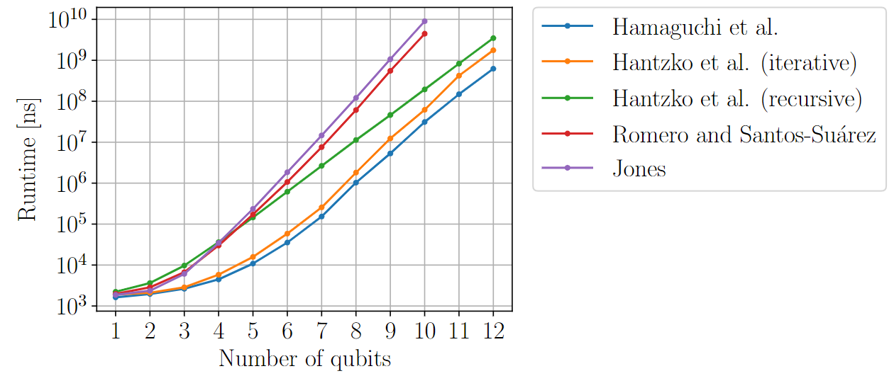

# paulidecomp

## Overview



This repository is a Python module of Pauli decomposition algorithms [1-4] implemented with C++.

Our C++ implementation is mostly based on [the Python implementation by Jones](https://github.com/TysonRayJones/DensePauliDecomposer/tree/revision),
except for the iterative algorithm by Hantzko et al. [2] since it is not included in the Python implementation.

## Setup

The C++ library `Boost` needs to be installed.

The `mprof` command is also required to run the memory benchmark.

It is recommended to prepare and use a new virtual Python environment.

You need to run `pip3 install -r requirements.txt` to set up the module. You may need to change the version of the Boost.Python and Boost.Numpy in `setup.py`.

## Test

You can test the module with `python3 -m pytest tests`.

## Benchmark

The `benchmarks` directory contains a set of files for benchmarking the algorithms.

You can benchmark the runtime of the algorithms by the following commands.
You can terminate the second command anytime.
```bash
cd benchmarks
python3 measure.py output_file.txt
python3 draw.py output_file.txt
```

You can check the memory consumption of the algorithms by `python memory.py [# of qubits]`.

## References

[1] Hiroki Hamaguchi, Kou Hamada, Nobuyuki Yoshioka. “Handbook for Efficiently Quantifying Robustness of Magic” (2023) arXiv:2311.01362.

[2] Lukas Hantzko, Lennart Binkowski, and Sabhyata Gupta. “Tensorized Pauli decomposition algorithm” (2023) arXiv:2310.13421.

[3] Tyson Jones. “Decomposing dense matrices into dense Pauli tensors” (2024). arxiv:2401.16378.

[4] Sebastián Vidal Romero and Juan Santos-Suárez. “PauliComposer: Compute tensor products of Pauli matrices efficiently”. Quantum Information Processing 22, 449 (2023).


## License

Copyright (c) 2024 Nobuyuki Yoshioka

This project is licensed under the MIT License - see the [LICENSE](LICENSE) file for details.
